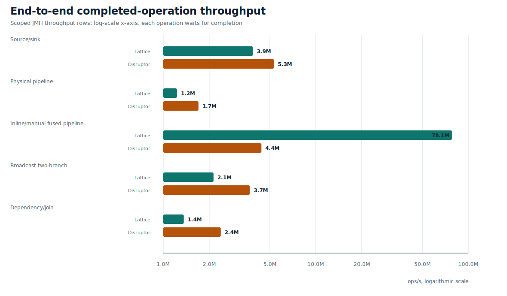
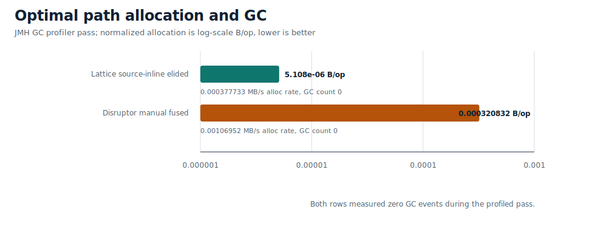

# Lattice Publication Benchmark Baseline

This document summarizes the checked-in benchmark baseline under
[`benchmarks/baseline/`](benchmarks/baseline/). It is the current public
results snapshot for regression review, open-source transparency, and research
comparison.

These numbers were refreshed on 2026-05-02 with the flags listed below. Keep
the raw JMH JSON and stdout logs with any quoted number.

## Validation Profile

| Property | Value |
| --- | --- |
| Host | WSL2 Linux `6.6.87.2-microsoft-standard-WSL2` |
| CPU | Intel Core i9-14900HX, 16 cores / 32 threads |
| NUMA | 1 node, CPUs 0-31 |
| JDK | OpenJDK 21.0.10+7-Ubuntu-124.04 |
| Gradle | 8.8 |
| JMH | 1.36 |
| Disruptor | 4.0.0 on the JMH classpath only |
| Native backend | Not loaded |

Common JVM flags:

```text
-Xms2g -Xmx2g
-XX:+AlwaysPreTouch
-XX:+UnlockDiagnosticVMOptions
-XX:+UseParallelGC
```

Graph runtime behavior is configured per graph through `FusionSpec`,
`MetricsSpec`, `GraphPlacementSpec`, and `DiagnosticsSpec`; the JVM flags above
are only the heap/GC profile.

See [`benchmarks/baseline/env.txt`](benchmarks/baseline/env.txt) for exact
include patterns and artifact profiles.

## Figures

| Figure | Description |
| --- | --- |
|  | Scoped headline publish rows plus the completion-gated optimal path with JMH error bars. |
|  | JMH sample-time percentile curve for Lattice fused, Lattice source-inline, and Disruptor manual-fused optimal paths. |
|  | Ratio view for the scoped headline rows. |
|  | Completion-gated source/sink, pipeline, broadcast, and dependency shapes. |
|  | GC-profiler normalized allocation and GC count for the optimal path. |

## Artifacts

| Artifact | Purpose |
| --- | --- |
| [`three-stage-scoped-2026-05-02.json`](benchmarks/baseline/three-stage-scoped-2026-05-02.json) | Scoped three-stage Lattice physical/inline-fused/reference publish rows vs Disruptor physical/manual-fused/reference rows. |
| [`end-to-end-scoped-2026-05-02.json`](benchmarks/baseline/end-to-end-scoped-2026-05-02.json) | Completion-gated source/sink, pipeline, broadcast, and dependency shapes against matching Disruptor rows. |
| [`optimal-path-completed-2026-05-02.json`](benchmarks/baseline/optimal-path-completed-2026-05-02.json) | Completion-gated optimal path with the longer 3-fork profile. |
| [`optimal-path-latency-2026-05-02.json`](benchmarks/baseline/optimal-path-latency-2026-05-02.json) | JMH sample-time latency percentiles for the optimal-path variants. |
| [`optimal-path-gc-2026-05-02.json`](benchmarks/baseline/optimal-path-gc-2026-05-02.json) | JMH GC-profiler pass for optimal-path allocation and GC count. |
| [`three-stage-vs-disruptor.json`](benchmarks/baseline/three-stage-vs-disruptor.json) | Broad three-stage Lattice physical/inline-fused vs Disruptor physical/manual-fused matrix retained for audit history. |
| [`three-stage-isolated-physical.json`](benchmarks/baseline/three-stage-isolated-physical.json) | Isolated semi-smoke physical three-stage Lattice vs Disruptor publish throughput. |
| [`three-stage-isolated-fused-copy.json`](benchmarks/baseline/three-stage-isolated-fused-copy.json) | Isolated semi-smoke Lattice inline-fused vs Disruptor manually fused copy-payload publish throughput. |
| [`three-stage-isolated-reference.json`](benchmarks/baseline/three-stage-isolated-reference.json) | Isolated semi-smoke reference-payload and equal-call-site Lattice vs Disruptor publish throughput. |
| [`optimal-path-completed.json`](benchmarks/baseline/optimal-path-completed.json) | Completion-gated optimal path: each operation waits for sink/handler completion. |
| [`lattice-core-basics.json`](benchmarks/baseline/lattice-core-basics.json) | Source/sink paths, batched topology, routing/topology rows, and raw edge regression rows. |
| [`lattice-placement.json`](benchmarks/baseline/lattice-placement.json) | Portable placement subset, first-touch on/off, pinning disabled. |

## Headline Results

### Top checked-in head-to-head rows

These rows use the matching 2026-05-02 scoped artifact for each published
workload.

| Comparison | Lattice (ops/s) | Lattice source | Disruptor (ops/s) | Disruptor source | Ratio |
| --- | ---: | --- | ---: | --- | ---: |
| Physical three-stage publish | 31,938,529 | `three-stage-scoped-2026-05-02.json` | 21,698,059 | `three-stage-scoped-2026-05-02.json` | 1.47x |
| Inline/manual fused copy publish | 127,875,286 | `three-stage-scoped-2026-05-02.json` | 35,697,152 | `three-stage-scoped-2026-05-02.json` | 3.58x |
| Manual fused reference publish, equal call-site | 209,168,722 | `three-stage-scoped-2026-05-02.json` | 31,091,239 | `three-stage-scoped-2026-05-02.json` | 6.73x |

The reference row uses equal call-site footing:
`latticeManuallyFusedReference` is one Lattice stage doing the same three
increments inline as the Disruptor manually fused handler. Lattice is ahead in
the scoped headline rows.

### Completed optimal path

| Benchmark | Score (ops/s) | Error |
| --- | ---: | ---: |
| Lattice inline-fused completed path | 77,868,589 | +-598,524 |
| Disruptor manually fused completed path | 3,620,353 | +-78,946 |

This benchmark closes the async publish-rate loophole: every operation waits
until the sink/handler confirms completion for the same sequence. On this host,
the Lattice inline-fused completed path measured 21.51x the Disruptor
busy-spin/manual-fused completed path.

### Broader end-to-end topology rows

| Workload | Lattice | Disruptor | Ratio |
| --- | ---: | ---: | ---: |
| Source/sink completed | 3,870,781 ops/s | 5,324,832 ops/s | 0.73x |
| Physical pipeline completed | 1,229,655 ops/s | 1,701,728 ops/s | 0.72x |
| Inline/manual fused pipeline completed | 78,108,324 ops/s | 4,399,426 ops/s | 17.75x |
| Broadcast two-branch completed | 2,135,888 ops/s | 3,700,906 ops/s | 0.58x |
| Dependency/join completed | 1,362,877 ops/s | 2,381,730 ops/s | 0.57x |

Rows with wide confidence intervals retain their JMH error bars in the tables
and figures. Do not rank close results without checking the raw JSON confidence
intervals and the matching topology semantics.

## Latency

Latency rows are from JMH sample-time mode over the same optimal-path workload:
parse, enrich, risk, serialize, then publish completion for the same sequence.

| Variant | p50 | p90 | p99 | p99.9 |
| --- | ---: | ---: | ---: | ---: |
| Lattice fused owner worker | 296 | 335 | 738 | 12,944 |
| Lattice source-inline elided | 30 | 40 | 58 | 290 |
| Disruptor manual fused | 243 | 310 | 491 | 11,172 |

## Allocation And GC

| Benchmark | Allocation rate | Normalized allocation | GC count |
| --- | ---: | ---: | ---: |
| Lattice inline-fused completed path | 0.000378 MB/s | 0.00000511 B/op | 0 |
| Disruptor manually fused completed path | 0.001070 MB/s | 0.000321 B/op | 0 |

## Reproduction

Build the benchmark jar:

```bash
./gradlew jmhJar
```

Representative command:

```bash
java -jar build/libs/lattice-1.0-SNAPSHOT-jmh.jar \
  "com.lattice.benchmark.OptimalPathBenchmark.*" \
  -f 3 -wi 5 -i 8 -w 5s -r 5s -bm thrpt -tu s \
  -jvmArgsAppend "-Xms2g -Xmx2g -XX:+AlwaysPreTouch -XX:+UnlockDiagnosticVMOptions -XX:+UseParallelGC" \
  -rf json -rff benchmarks/baseline/optimal-path-completed-2026-05-02.json
```

Use [`docs/linux-validation.md`](docs/linux-validation.md) to reproduce the
same methodology on another Linux host before claiming results for that
hardware profile.
