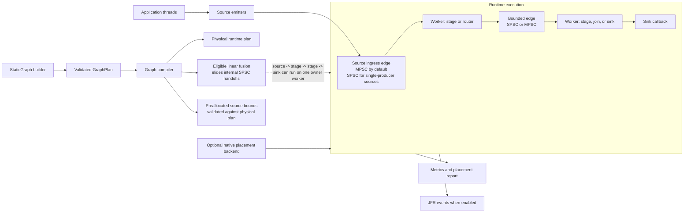

# Lattice

Lattice is a Java 21 static-topology runtime for fixed, low-latency processing
graphs. It compiles a declared graph of sources, stages, routing nodes, joins,
and sinks into bounded SPSC/MPSC edges and dedicated workers, with optional
stage fusion, preallocated source payloads, metrics, JFR events, and native
Linux placement diagnostics.

It is built for systems where the processing shape is known before startup:
market-data style pipelines, event validation chains, reserved-core services,
and other workloads that can trade elasticity for locality and deterministic
backpressure. It is not a distributed stream processor or a general queue
replacement.

## What It Does

- Static graph DSL with source, stage, sink, dispatch, broadcast, partition,
  and join nodes.
- Bounded SPSC and MPSC ring edges with explicit overflow and wait policies.
- Single-producer source specialization and public preallocated source emitters.
- Opt-in linear stage fusion for eligible source -> stage -> sink segments.
- Graph, stage, edge, placement, routing, join, wait, and ownership metrics.
- Optional JFR events behind `-Dlattice.jfr=true`.
- Optional Rust JNI backend for Linux affinity and placement diagnostics.
- JUnit, JCStress, and JMH coverage in the current single Gradle project.

Current status: the repository is source-ready but not yet published to Maven
Central. The current build baseline is Java 21, the JPMS module is
`com.lattice`, and the optional native backend is JNI rather than FFM.

## Architecture



The logical graph remains visible through the public plan and metrics. Fusion
changes the physical execution plan only when the compiler can prove that the
observable semantics are still acceptable for the configured topology.

## Getting Started

Requirements:

- JDK 21
- The checked-in Gradle wrapper
- Rust and Cargo only if you need the optional native placement backend

Build and test:

```powershell
.\gradlew.bat test
.\gradlew.bat jmhClasses
```

Minimal graph:

```java
import com.lattice.edge.EdgeSpec;
import com.lattice.graph.SourceMode;
import com.lattice.graph.StaticGraph;
import com.lattice.stage.Emitter;
import com.lattice.stage.StageSpec;
import java.time.Duration;

record Order(int id, boolean valid) {}
record ValidOrder(int id) {}

StaticGraph graph = StaticGraph.builder("orders")
    .source("ingress", Order.class, SourceMode.SINGLE_PRODUCER)
    .stage(
        "validate",
        Order.class,
        ValidOrder.class,
        (order, out, ctx) -> {
            if (order.valid()) {
                out.push(new ValidOrder(order.id()));
            }
        },
        StageSpec.singleThreaded()
    )
    .sink("egress", ValidOrder.class, order -> {
        // Persist, publish, or hand off the validated order.
    }, StageSpec.singleThreaded())
    .edge("ingress", "validate", EdgeSpec.mpscRing(1024))
    .edge("validate", "egress", EdgeSpec.spscRing(1024))
    .build();

graph.start();
Emitter<Order> ingress = graph.emitter("ingress", Order.class);
ingress.emit(new Order(1, true));
ingress.close();
graph.awaitTermination(Duration.ofSeconds(5));
```

The ingress edge is declared as MPSC at the DSL boundary, but the compiler can
rewrite it to a physical SPSC edge because the source is marked
`SINGLE_PRODUCER`.

## Published Local Benchmarks

These are current local JMH artifacts from `results/apples-2026-04-26/` on
Windows with JDK 21. They are useful direction for open-source readers, not a
Linux/NUMA release claim.

| Scenario | Result | Source artifact | Notes |
|---|---:|---|---|
| Lattice fused three-stage pipeline | 79.13M ops/s | `pipeline-current-isolated.json` | Fusion enabled; internal handoffs compiled away. |
| Lattice physical three-stage pipeline | 27.13M ops/s | `pipeline-current-isolated.json` | Same pipeline shape without fused execution. |
| Disruptor three-stage pipeline | 6.97M ops/s | `pipeline-current-isolated.json` | Comparison row for this benchmark model. |
| Lattice fused pipeline with GC profiler | 41.07M ops/s, about 0 B/op | `pipeline-fused-current-isolated-gc.json` | GC profiler changes the measured throughput; use allocation data separately. |
| Lattice semantic join | 6.05M ops/s, about 0 B/op | `apples-fair-join-pooled.json` | Join semantics and payload model matter. |
| Disruptor dependency graph | 10.32M ops/s | `apples-fair-join-pooled.json` | Dependency graph comparison, not a general Disruptor result. |
| Lattice MPSC reference row | 8.51M ops/s | `apples-fair-join-pooled.json` | Four benchmark threads. |
| Disruptor MPSC reference row | 19.44M ops/s | `apples-fair-join-pooled.json` | Four benchmark threads. |
| Disruptor single-producer baseline | 33.66M ops/s | `disruptor-baseline-single.json` | Use this baseline instead of the anomalous SPSC apples Disruptor row. |

Caveats:

- These results were collected on a Windows development host. Scheduling
  variance is visible in several confidence intervals.
- GC-profiler runs are not directly comparable to non-profiled throughput
  runs; profiler overhead can materially change ops/s.
- Apples-to-apples rows depend on payload ownership and dependency semantics.
  Do not compare a pooled mutable Lattice path with an allocating Disruptor
  path unless that is the workload being claimed.
- One SPSC apples Disruptor row in this result set was anomalously bad; the
  standalone Disruptor single-producer baseline is the safer reference.

For tuning guidance, JVM flags, and benchmark methodology, see
[PERFORMANCE_TUNING.md](PERFORMANCE_TUNING.md).

## Documentation

- [Getting Started](docs/getting-started.md)
- [Graph DSL](docs/graph-dsl.md)
- [Edge Semantics](docs/edge-semantics.md)
- [Ordering Guarantees](docs/ordering-guarantees.md)
- [Backpressure](docs/backpressure.md)
- [Observability](docs/observability.md)
- [Performance Tuning](PERFORMANCE_TUNING.md)
- [Source Specialization And Fusion](docs/source-specialization-and-fusion.md)
- [Disruptor Comparison](docs/disruptor-comparison.md)
- [Operations Runbook](docs/operations-runbook.md)
- [Failure Modes](docs/failure-modes.md)
- [Compatibility Matrix](docs/compatibility-matrix.md)
- [Linux Validation Notes](docs/linux-validation.md)

Examples:

- [Examples overview](docs/examples/README.md)
- [Preallocated source/sink](src/examples/java/com/lattice/examples/PreallocatedSourceSinkExample.java)
- [Fused linear pipeline](src/examples/java/com/lattice/examples/FusedLinearPipelineExample.java)
- [Routing and join](src/examples/java/com/lattice/examples/RoutingJoinExample.java)
- [Metrics diagnostics](src/examples/java/com/lattice/examples/MetricsDiagnosticsExample.java)
- [Benchmark-style fast path](src/examples/java/com/lattice/examples/BenchmarkStyleFastPathExample.java)

## Build, Test, And Native Backend

Windows:

```powershell
.\gradlew.bat test
.\gradlew.bat jmhClasses
.\gradlew.bat jcstress
```

Linux or WSL:

```bash
./gradlew test
./gradlew jmhClasses
./gradlew jcstress
```

Build the optional Rust JNI backend:

```bash
./gradlew nativeBuildRelease
```

Run Java with the native library visible:

```bash
java -Djava.library.path=native/static-topology-native/target/release ...
```

Without the native library, placement requests degrade through metrics and
startup diagnostics by default. Set `-Dlattice.placement.strict=true` to fail
startup when requested placement cannot be applied.

## Positioning

Lattice is strongest when a static topology lets the compiler replace broad
coordination with edge-local sequencing, source specialization, fusion, and
bounded memory. Disruptor and other shared-ring designs can still be better for
workloads that naturally have one global sequence domain or broad multicast
dependency barriers.
