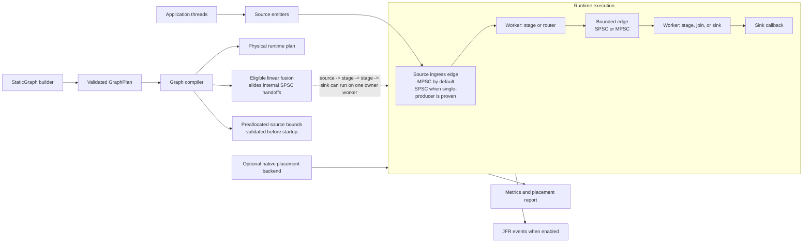

# Lattice

Lattice is a Java 21 runtime for bounded, low-latency, in-process processing
graphs whose topology is known before startup. Applications declare sources,
stages, routing nodes, joins, and sinks; Lattice validates the graph and
compiles it into dedicated workers connected by bounded SPSC and MPSC ring
edges.

The core idea is simple: if the graph is static, the runtime can remove work
that a generic queue, broker, or dynamic stream processor has to keep. Lattice
uses that information for source specialization, preallocated payload paths,
edge-local backpressure, deterministic ownership, and optional linear stage
fusion.

Lattice is not a distributed stream processor, message broker, persistence
layer, or general-purpose queue replacement. It is an in-process runtime for
fixed Java graphs with explicit backpressure and observable failure semantics.

## Status

- Pre-1.0. Source checkout is the supported path until Maven Central artifacts
  are published.
- Java 21 is the current build baseline.
- The JPMS module name is `com.lattice`.
- The main runtime is Java. The optional native backend is Rust JNI for Linux
  placement and topology diagnostics.
- Licensed under the [Apache License 2.0](LICENSE).

## Contents

- [When To Use Lattice](#when-to-use-lattice)
- [Runtime Guarantees](#runtime-guarantees)
- [Features](#features)
- [Architecture](#architecture)
- [Quick Start](#quick-start)
- [Performance Snapshot](#performance-snapshot)
- [Build And Verification](#build-and-verification)
- [Native Placement Backend](#native-placement-backend)
- [Documentation](#documentation)
- [Contributing And Security](#contributing-and-security)

## When To Use Lattice

Use Lattice when the processing shape is fixed and performance depends on
predictable handoff, ownership, and backpressure:

- market-data, order-validation, risk, telemetry, or enrichment pipelines;
- reserved-core services where worker placement and wait policy are deliberate;
- serial Java pipelines where logical stages should remain visible but physical
  handoffs can be fused away;
- workloads that can reuse mutable payloads through preallocated source pools;
- systems where overload should become explicit backpressure, rejection, loss,
  redirect, or a documented application decision.

Lattice is usually the wrong tool when:

- topology must be created, removed, or rebalanced dynamically at runtime;
- work must be durable, replayable, distributed, or brokered between processes;
- one global sequence domain or broad multicast dependency barrier is the
  natural model;
- unbounded queues are acceptable or desired;
- untrusted user code needs sandboxing. Stage logic, key extractors, join
  combiners, copiers, and exception handlers run as trusted application code.

The most defensible public claim is not "Lattice is faster than Disruptor."
The real claim is:

> Lattice can make fixed Java processing graphs much faster when the compiler
> can specialize source ingress, preallocate payloads, and fuse serial logical
> stages into fewer physical handoffs.

## Runtime Guarantees

Lattice keeps its guarantees local and explicit:

- **Static topology:** graph shape is declared before startup and cannot be
  mutated while running.
- **Bounded memory:** every edge has configured capacity. Overload is handled
  by the configured overflow policy, not hidden unbounded buffering.
- **Edge ordering:** SPSC edges preserve producer order for accepted items.
  MPSC edges preserve successful reservation/publication order, which is not
  the same as wall-clock order across producer threads.
- **Stage ownership:** `StageSpec.singleThreaded()` stages are invoked by one
  worker at a time. User stage code owns any additional thread safety it
  introduces.
- **Backpressure visibility:** blocking, timed blocking, fail-fast, lossy,
  coalescing, and redirect policies are explicit and surfaced through metrics.
- **Lifecycle semantics:** closing sources drains accepted queued work.
  `abort()` is fail-fast and does not promise drain.
- **Fusion semantics:** fusion changes the physical runtime plan only when the
  compiler can preserve the logical graph contract.
- **Preallocation safety:** preallocated sources validate pool type and
  claim/emit identity. The compiler rejects unsupported reuse topologies.
- **No hidden durability:** Lattice does not provide transactional rewind,
  replay, persistence, distributed durability, or exactly-once external effects.
- **Native placement is optional:** without the native library, placement
  requests degrade through diagnostics unless strict placement is enabled.

See [Ordering Guarantees](docs/ordering-guarantees.md), [Edge Semantics](docs/edge-semantics.md),
and [Failure Modes](docs/failure-modes.md) for the detailed contract.

## Features

- Static graph DSL for sources, stages, sinks, dispatch, broadcast, partition,
  and join nodes.
- Bounded SPSC and MPSC ring edges with explicit wait and overflow policies.
- Single-producer source specialization when producer ownership is proven.
- Public preallocated source emitters for reusable payload paths.
- Opt-in linear stage fusion for eligible source-to-sink chains.
- Semantic joins by stamp, with duplicate, timeout, and missing-branch policy.
- Graph, stage, edge, placement, routing, join, wait, slab, and ownership
  metrics.
- Optional JFR events behind `-Dlattice.jfr=true`.
- Optional Rust JNI backend for Linux affinity and placement diagnostics.
- JUnit, JCStress, JMH, example, source, javadoc, and release metadata gates.

## Architecture



The logical graph remains inspectable. Compiler optimizations affect the
physical runtime plan only when configured semantics can be preserved.

## Quick Start

Requirements:

- JDK 21.
- The checked-in Gradle wrapper.
- Rust and Cargo only if you need the optional native placement backend.

Build on Windows:

```powershell
.\gradlew.bat test
.\gradlew.bat jmhClasses
```

Build on Linux or WSL:

```bash
./gradlew test
./gradlew jmhClasses
```

Minimal graph:

```java
import com.lattice.edge.EdgeSpec;
import com.lattice.graph.SourceMode;
import com.lattice.graph.StaticGraph;
import com.lattice.stage.Emitter;
import com.lattice.stage.StageSpec;
import java.time.Duration;

record Order(int id, boolean valid) {}
record ValidOrder(int id) {}

StaticGraph graph = StaticGraph.builder("orders")
    .source("ingress", Order.class, SourceMode.SINGLE_PRODUCER)
    .stage(
        "validate",
        Order.class,
        ValidOrder.class,
        (order, out, ctx) -> {
            if (order.valid()) {
                out.push(new ValidOrder(order.id()));
            }
        },
        StageSpec.singleThreaded()
    )
    .sink(
        "egress",
        ValidOrder.class,
        order -> {
            // Persist, publish, or hand off the validated order.
        },
        StageSpec.singleThreaded()
    )
    .edge("ingress", "validate", EdgeSpec.mpscRing(1024))
    .edge("validate", "egress", EdgeSpec.spscRing(1024))
    .build();

graph.start();

Emitter<Order> ingress = graph.emitter("ingress", Order.class);
ingress.emit(new Order(1, true));
ingress.close();

graph.awaitTermination(Duration.ofSeconds(5));
```

The source is marked `SINGLE_PRODUCER`, which is a correctness contract. When
the topology allows it, the compiler can specialize the physical ingress edge
even if the DSL edge was declared as MPSC for readability.

## Performance Snapshot

The repository includes local benchmark artifacts under
`docs/benchmark-results/`. These numbers are useful for orientation, but they
are not Linux, NUMA, or release-grade performance claims.

| Scenario | Lattice | Comparison | Source Artifact | Reading |
| --- | ---: | ---: | --- | --- |
| Fused three-stage pipeline | 79.13M ops/s | Disruptor: 6.97M ops/s | `docs/benchmark-results/apples-2026-04-26/pipeline-current-isolated.json` | Strong Lattice shape: serial logical stages compile into one worker. |
| Physical three-stage pipeline | 27.13M ops/s | Disruptor: 6.97M ops/s | `docs/benchmark-results/apples-2026-04-26/pipeline-current-isolated.json` | Same logical pipeline without fused execution. |
| Fused pipeline with GC profiler | 41.07M ops/s, about 0 B/op | n/a | `docs/benchmark-results/apples-2026-04-26/pipeline-fused-current-isolated-gc.json` | Use allocation evidence separately from non-profiled throughput. |
| Semantic join / dependency graph | 6.78M ops/s | Disruptor: 6.96M ops/s | `docs/benchmark-results/apples-2026-04-26/final-hotpaths-after-final-pass.json` | Not identical semantics: Lattice correlates by join semantics; Disruptor uses sequence barriers. |
| MPSC reference handoff | 8.69M ops/s | Disruptor: 21.47M ops/s | `docs/benchmark-results/apples-2026-04-26/final-hotpaths-after-final-pass.json` | Disruptor remains much stronger for this primitive shape. |
| Single-producer Disruptor baseline | n/a | Disruptor: 33.66M ops/s | `docs/benchmark-results/apples-2026-04-26/disruptor-baseline-single.json` | Baseline for a natural shared-ring single-producer workload. |

Benchmark caveats:

- The listed results were captured on a Windows development host with JDK 21.
- GC-profiler runs are not directly comparable to non-profiled throughput
  runs.
- Apples-to-apples rows depend on payload ownership, allocation behavior, wait
  policy, and dependency semantics.
- Lattice should lead with static-topology and fusion results, not a blanket
  "faster than Disruptor" claim.
- MPSC reference handoff remains the clearest primitive-edge performance gap.

For tuning guidance, JVM flags, and methodology notes, see
[Performance Tuning](PERFORMANCE_TUNING.md),
[Disruptor Comparison](docs/disruptor-comparison.md), and
[Benchmark Baseline](docs/benchmark-baseline.md).

## Build And Verification

Common checks:

```bash
./gradlew test
./gradlew jmhClasses
./gradlew examplesClasses
```

Windows uses the same tasks through `.\gradlew.bat`.

Release-oriented local gate:

```bash
./gradlew releaseCheck
./gradlew javadoc
```

Concurrency validation:

```bash
./gradlew jcstress
```

The current portable gate builds runtime classes, examples, tests, JMH classes,
JCStress classes, source and javadoc artifacts, Maven metadata, and public docs
link/benchmark references. Full JCStress is intentionally run as a separate
longer validation step.

## Native Placement Backend

The native backend is optional and currently uses Rust JNI. Build it when you
need Linux affinity or placement diagnostics:

```bash
./gradlew nativeBuildRelease
```

Run Java with the native library visible:

```bash
java -Djava.library.path=native/static-topology-native/target/release ...
```

Without the native library, placement requests degrade through startup
diagnostics and metrics by default. Set `-Dlattice.placement.strict=true` to
fail startup when requested placement cannot be applied.

Placement-sensitive benchmark claims should be made on Linux with the native
backend loaded and CPU topology recorded. See [Linux Validation Notes](docs/linux-validation.md).

## Documentation

- [Getting Started](docs/getting-started.md)
- [Graph DSL](docs/graph-dsl.md)
- [Edge Semantics](docs/edge-semantics.md)
- [Ordering Guarantees](docs/ordering-guarantees.md)
- [Backpressure](docs/backpressure.md)
- [Observability](docs/observability.md)
- [Performance Tuning](PERFORMANCE_TUNING.md)
- [Source Specialization and Fusion](docs/source-specialization-and-fusion.md)
- [Disruptor Comparison](docs/disruptor-comparison.md)
- [Operations Runbook](docs/operations-runbook.md)
- [Failure Modes](docs/failure-modes.md)
- [Compatibility Matrix](docs/compatibility-matrix.md)
- [Release Packaging Notes](docs/release.md)

Examples:

- [Examples overview](docs/examples/README.md)
- [Preallocated source/sink](src/examples/java/com/lattice/examples/PreallocatedSourceSinkExample.java)
- [Fused linear pipeline](src/examples/java/com/lattice/examples/FusedLinearPipelineExample.java)
- [Routing and join](src/examples/java/com/lattice/examples/RoutingJoinExample.java)
- [Metrics diagnostics](src/examples/java/com/lattice/examples/MetricsDiagnosticsExample.java)
- [Benchmark-style fast path](src/examples/java/com/lattice/examples/BenchmarkStyleFastPathExample.java)

## Contributing And Security

Read [CONTRIBUTING.md](CONTRIBUTING.md) before opening changes. Runtime changes
should preserve the project scope: fixed in-process graphs, explicit
backpressure, measured hot paths, and clear operational diagnostics.

Security reporting guidance is in [SECURITY.md](SECURITY.md).
