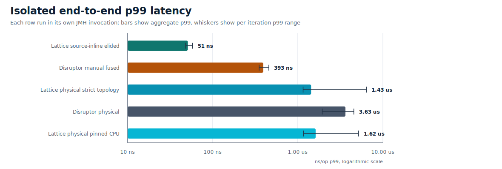

# Lattice


Lattice is a Java 21 runtime for bounded, low-latency, in-process processing
graphs whose topology is known before startup. Applications declare sources,
stages, routing nodes, joins, sinks, and edges; Lattice validates the graph and
compiles it into dedicated workers connected by bounded SPSC and MPSC rings.

The motivating case is a service that already knows its processing shape:
orders flow through validation and risk, market data flows through enrichment,
telemetry flows through filtering and fan-out. A generic queue, broker, or
dynamic stream processor must keep machinery for topology changes and broad
delivery semantics. Lattice narrows the problem to one fixed in-process graph,
then makes the ownership, backpressure, and failure contract explicit.

The core idea is simple: when the graph is static, the runtime can remove work
that a generic queue, broker, or dynamic stream processor has to keep. Lattice
uses that information for source specialization, preallocated payload paths,
edge-local backpressure, deterministic ownership, and eligible linear fusion.

Preallocated payload paths are deliberately compiler-checked rather than
discipline-based: Lattice accepts reuse only for shapes it can prove safe and
rejects routing, overflow, or ownership patterns that would make reuse
ambiguous.

Lattice is not a distributed stream processor, message broker, persistence
layer, or general-purpose queue replacement. It is an in-process runtime for
fixed Java graphs with explicit backpressure and observable failure semantics.

## Status

- Pre-1.0. Build from source until the first Maven Central release is
  published.
- Java 21 is the build baseline.
- The JPMS module name is `com.lattice`.
- The core runtime is Java. The optional native backend is Rust JNI for
  placement and topology diagnostics.
- Licensed under the [Apache License 2.0](LICENSE).

## Quick Start

Requirements:

- JDK 21.
- The checked-in Gradle wrapper.
- Rust and Cargo only if you need the optional native placement backend.

Build and run the main checks:

```bash
./gradlew test
./gradlew jmhClasses examplesClasses
```

Minimal graph:

```java
import com.lattice.edge.EdgeSpec;
import com.lattice.graph.FusionSpec;
import com.lattice.graph.MetricsSpec;
import com.lattice.graph.SourceMode;
import com.lattice.graph.StaticGraph;
import com.lattice.stage.Emitter;
import com.lattice.stage.StageSpec;
import java.time.Duration;

record Order(int id, boolean valid) {}
record ValidOrder(int id) {}

StaticGraph graph = StaticGraph.builder("orders")
    .fusion(FusionSpec.defaults())
    .metrics(MetricsSpec.off())
    .source("ingress", Order.class, SourceMode.SINGLE_PRODUCER)
    .stage("validate", Order.class, ValidOrder.class,
        (order, out, ctx) -> {
            if (order.valid()) {
                out.push(new ValidOrder(order.id()));
            }
        },
        StageSpec.singleThreaded())
    .sink("egress", ValidOrder.class, order -> { }, StageSpec.singleThreaded())
    .edge("ingress", "validate", EdgeSpec.spscRing(1024))
    .edge("validate", "egress", EdgeSpec.spscRing(1024))
    .build();

graph.start();

Emitter<Order> ingress = graph.emitter("ingress", Order.class);
ingress.emit(new Order(1, true));
ingress.close();

graph.awaitTermination(Duration.ofSeconds(5));
```

The source is marked `SINGLE_PRODUCER`, which is a correctness contract: at
most one application thread may call the emitter at a time. Use the default
multi-producer source plus an MPSC ingress edge when ownership is not
mechanically true.

## When To Use Lattice

Use Lattice when the processing shape is fixed and performance depends on
predictable handoff, ownership, and backpressure:

- market-data, order-validation, risk, telemetry, or enrichment pipelines;
- reserved-core services where worker placement and wait policy are explicit;
- serial Java pipelines where logical stages remain visible but physical
  handoffs can be fused away;
- workloads that can reuse mutable payloads through preallocated source pools;
- systems where overload should become explicit backpressure, rejection, loss,
  redirect, or a documented application decision.

Lattice is usually the wrong tool when topology must be created, removed, or
rebalanced dynamically at runtime, or when work must be durable, replayable,
distributed, or brokered between processes.

## Lattice And Disruptor

Disruptor is the right comparison because it set the standard for low-latency
JVM event processing. Lattice is not a wrapper around that model. It is a
different bet: when the application is a fixed typed graph, the runtime should
see the graph, validate the graph, and specialize the graph.

Use Disruptor when the workload really is one ordered stream, one preallocated
ring, and sequence-barrier dependency management. Use Lattice when the system
is a static DAG: local overload policy per edge, routing and stamp-correlated
joins as graph primitives, inspectable graph state, optional placement
diagnostics, compiler-checked payload reuse, and fusion that removes physical
handoffs without erasing the logical stages.

For static graph workloads, Lattice is the system this repository argues for.
The benchmark set supports that argument: Lattice leads the scoped physical
publish, fused publish, equal-call-site reference, source-inline completed,
and physical p99 latency rows on the current public baseline.

## How It Works

Lattice compiles a declared graph into an immutable runtime plan before any
worker starts. The compiler validates node names, edge type compatibility,
source producer contracts, routing shape, join stamps, placement requests, and
preallocation/fusion eligibility. At runtime the graph executes that fixed plan
instead of rediscovering topology or dependency structure on every message.

The hot path is intentionally narrow:

- Sources publish into bounded SPSC or MPSC edges, or run an eligible fused
  chain directly on the source thread when `SourceMode.SINGLE_PRODUCER` proves
  ownership and `FusionSpec.inlineSources(true)` is enabled for that graph.
- Stages are single-owner callbacks. A stage sees one message or one batch at a
  time and pushes through typed `Output` handles.
- Linear SPSC chains can be fused so logical stages remain visible in the plan
  while physical handoffs disappear.
- Preallocated sources claim mutable payload instances from a checked pool;
  the compiler rejects shapes where reuse would be unsafe.
- Routing nodes (`dispatch`, `broadcast`, `partition`) and joins are graph
  primitives rather than ad hoc queue consumers.
- Runtime controls are graph-local: `FusionSpec`, `MetricsSpec`,
  `GraphPlacementSpec`, and `DiagnosticsSpec` replace process-global fusion,
  metrics, placement, and JFR flags.

## Per-Graph Runtime Controls

Runtime behavior is configured on each `StaticGraph.Builder`:

```java
StaticGraph graph = StaticGraph.builder("orders")
    .fusion(FusionSpec.defaults()
        .inlineSources(true)
        .elideInlineSourcePhysicalPath(true))
    .metrics(MetricsSpec.off()
        .hotCounters(true)
        .fusedLogicalEdgeCounters(true))
    .placement(GraphPlacementSpec.off()
        .strict(true))
    .diagnostics(DiagnosticsSpec.off()
        .jfr(true))
    .build();
```

Defaults are fusion on, metrics off, source inline off, source physical-path
elision off, topology-aware placement off, strict placement off, first-touch
placement off, and JFR off. Source-inline fusion is an execution-thread
contract: stage and sink logic may run on the caller of `emitter.emit(...)`.
It is blocked when explicit effective placement or topology-aware placement is
in effect so pinned/topology-placed stage logic remains on the placed owner
worker.

## Runtime Guarantees

Lattice keeps its guarantees local and explicit:


- Static topology: graph shape is declared before startup and cannot be mutated
  while running.
- Bounded memory: every edge has configured capacity.
- Edge ordering: SPSC preserves producer order; MPSC preserves successful
  reservation/publication order.
- Stage ownership: single-threaded stages are invoked by one worker at a time.
- Backpressure visibility: blocking, timed blocking, fail-fast, drop-latest,
  drop-oldest, coalescing, and redirect policies are explicit.
- Lifecycle semantics: closing sources drains accepted queued work; `abort()`
  is fail-fast and does not promise drain.
- No hidden durability: Lattice does not provide transactional rewind, replay,
  persistence, distributed durability, or exactly-once external effects.

See [Ordering Guarantees](docs/ordering-guarantees.md),
[Edge Semantics](docs/edge-semantics.md), and
[Failure Modes](docs/failure-modes.md) for the detailed contract.

## Performance Snapshot

The checked-in benchmark material is the current public baseline. Start with
the release snapshot index, then cite the underlying host, JVM flags, benchmark
class, and JSON artifact for any number you quote. The 2026-05-02 refresh
includes scoped publish-throughput rows, completion-gated end-to-end rows,
isolated end-to-end p99 latency rows for Lattice source-inline elision,
Lattice physical placement, and matching Disruptor controls, plus a GC-profiler
pass for the optimal path. Full isolated percentile curves live in the latency
profile.

The benchmark story is stronger than "sometimes faster." The first three rows are
publish-throughput rows from `ApplesToApplesDisruptorBenchmark`: one JMH
operation publishes one item. The completed row is stricter: one operation
publishes one item and waits for the matching sink/handler completion.

- The table uses the matching scoped JMH artifact for each workload rather
  than mixing older isolated and full-matrix runs.
- The Disruptor manually fused reference row collapses three increments into
  one handler call; the matching Lattice row uses the best equal-call-site
  `latticeManuallyFusedReference` result: 209.2M ops/s.
- The physical publish row keeps the graph physical and still has Lattice
  ahead at 1.47x.
- The source-inline completed Lattice row runs an eligible fused chain on the
  producer thread and removes the physical source edge. It is a graph
  specialization path, not a generic queued handoff.
- The physical latency comparison is also meaningful: Disruptor is lower at
  mean/p50/p90, while Lattice strict topology is lower at p99/p99.9.
- The broader completed-operation matrix remains in the README because it
  marks the current boundary: simple source/sink, fully physical completed
  pipeline, broadcast, and dependency rows favor Disruptor on this host.




In isolated p99 runs, Lattice source-inline elided measured 51 ns versus
393 ns for Disruptor manual fused. That mode has no source ring to fill: the
caller runs the eligible fused chain synchronously. Lattice physical strict
topology measured 1.43 us p99 versus 3.63 us for Disruptor physical, while
Disruptor physical was lower at mean, p50, and p90 in the same run.

| Scoped headline row | Lattice | Disruptor | Ratio |
| --- | ---: | ---: | ---: |
| Three-stage physical publish throughput | 31,938,529 ops/s | 21,698,059 ops/s | 1.47x |
| Three-stage inline/manual fused publish | 127,875,286 ops/s | 35,697,152 ops/s | 3.58x |
| Manually fused reference payload, equal call-site | 209,168,722 ops/s | 31,091,239 ops/s | 6.73x |
| Source-inline completed path | 77,868,589 ops/s | 3,620,353 ops/s | 21.51x |

The broader completed-operation matrix is intentionally shown as a boundary,
not as the headline:

| Completed-operation shape | Lattice | Disruptor | Ratio |
| --- | ---: | ---: | ---: |
| Source/sink completed | 3,870,781 ops/s | 5,324,832 ops/s | 0.73x |
| Physical pipeline completed | 1,229,655 ops/s | 1,701,728 ops/s | 0.72x |
| Inline/manual fused pipeline completed | 78,108,324 ops/s | 4,399,426 ops/s | 17.75x |
| Broadcast two-branch completed | 2,135,888 ops/s | 3,700,906 ops/s | 0.58x |
| Dependency/join completed | 1,362,877 ops/s | 2,381,730 ops/s | 0.57x |

- [Benchmark Results](docs/benchmark-results/README.md)
- [Benchmark Baseline](BENCHMARK_BASELINE.md)
- [Latency Profile](docs/latency.md)
- [Benchmark Devices](docs/devices.md)
- [Disruptor Comparison](docs/disruptor-comparison.md)
- [Linux Validation Notes](docs/linux-validation.md)
- [Performance Tuning](PERFORMANCE_TUNING.md)

The public claim is direct: for fixed Java processing graphs, Lattice gives the
runtime more structure than a queue or single-ring sequencer can see. That
structure lets Lattice specialize source ingress, validate payload reuse,
preserve logical stages while removing eligible handoffs, and win several of
the benchmark rows that matter most for static graph workloads. It is not a
universal "always faster" claim; it is an architecture-specific performance
and ergonomics claim.

## Build And Verification

Common checks:

```bash
./gradlew test
./gradlew jmhClasses
./gradlew examplesClasses
```

Release-oriented local gate:

```bash
./gradlew releaseCheck
./gradlew javadoc
```

Concurrency validation:

```bash
./gradlew jcstress
```

The portable release gate builds runtime classes, examples, tests, JMH classes,
JCStress classes, source and Javadoc artifacts, Maven metadata, and public docs
link/benchmark references. Full JCStress is intentionally kept as a longer
validation step.

## Native Placement Backend

The native backend is optional and currently uses Rust JNI. Build it when you
need host affinity, placement diagnostics, or first-touch support:

```bash
./gradlew nativeBuildRelease
```

Run Java with the native library visible:

```bash
java -Djava.library.path=native/static-topology-native/target/release ...
```

Linux exposes the full native placement surface. Windows and macOS expose
narrower capability bits; see the [Compatibility Matrix](docs/compatibility-matrix.md)
before making platform-specific placement claims. Without the native library,
placement requests degrade through startup diagnostics and metrics by default.
Set `GraphPlacementSpec.off().strict(true)` on the graph to fail startup when
requested placement cannot be applied.

For Linux CPU-set policies, Lattice treats the set as "run on any of these
CPUs that the scheduler currently allows." That means explicit worker pinning
respects cgroups, `taskset`, and service manager CPU limits while still making
use of a partial overlap. If there is no overlap, startup degrades or fails
according to the graph's strict-placement setting.

## Documentation

The `/docs` directory is ready to use as the GitHub Pages source. Until Pages
is enabled, GitHub shows generated Javadocs as checked-in HTML files rather
than as a rendered API site. Start at [Documentation Home](docs/index.md) when
browsing the repository.

| Area | Links |
| --- | --- |
| First steps | [Getting Started](docs/getting-started.md), [Examples](docs/examples/README.md) |
| Graph model | [Graph DSL](docs/graph-dsl.md), [Architecture](docs/architecture.md), [Source Specialization and Fusion](docs/source-specialization-and-fusion.md) |
| Runtime contract | [Edge Semantics](docs/edge-semantics.md), [Ordering Guarantees](docs/ordering-guarantees.md), [Backpressure](docs/backpressure.md), [Failure Modes](docs/failure-modes.md) |
| Operations | [Observability](docs/observability.md), [Operations Runbook](docs/operations-runbook.md), [Compatibility Matrix](docs/compatibility-matrix.md) |
| Release | [API Reference](docs/api.md), [Generated Javadocs HTML](docs/api/latest/index.html), [Release Process](docs/release.md), [Benchmark Results](docs/benchmark-results/README.md) |

## Contact

For questions or feedback, contact Leonidas Kanarelis at
[leonidaskanarelis@gmail.com](mailto:leonidaskanarelis@gmail.com).

## Project Policies

- [Changelog](CHANGELOG.md)
- [Contributing](CONTRIBUTING.md)
- [Code of Conduct](CODE_OF_CONDUCT.md)
- [Security Policy](SECURITY.md)
- [Notice](NOTICE)
- [License](LICENSE)
