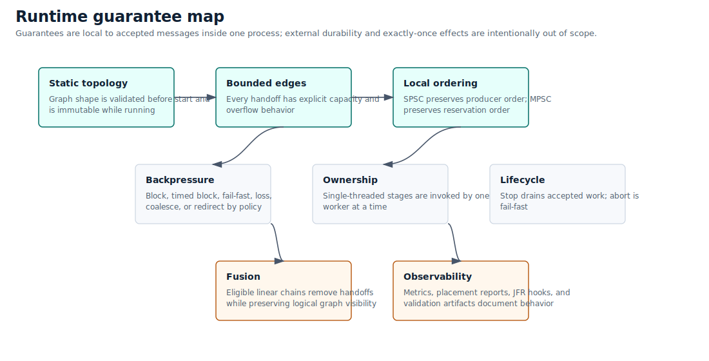
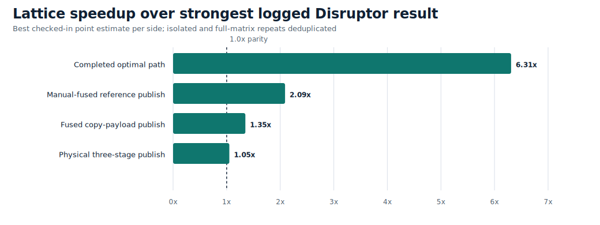
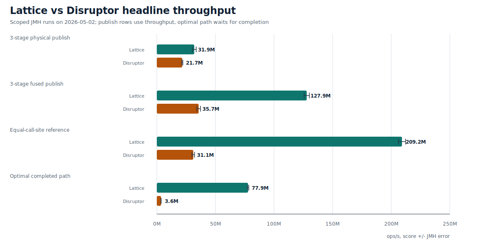
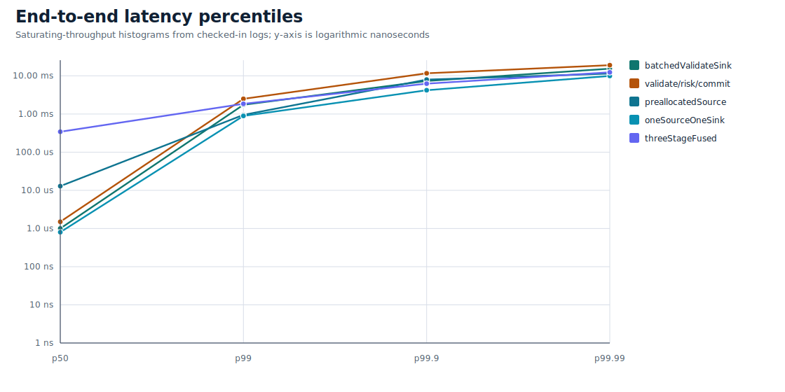

# Lattice


Lattice is a Java 21 runtime for bounded, low-latency, in-process processing
graphs whose topology is known before startup. Applications declare sources,
stages, routing nodes, joins, sinks, and edges; Lattice validates the graph and
compiles it into dedicated workers connected by bounded SPSC and MPSC rings.

The core idea is simple: when the graph is static, the runtime can remove work
that a generic queue, broker, or dynamic stream processor has to keep. Lattice
uses that information for source specialization, preallocated payload paths,
edge-local backpressure, deterministic ownership, and eligible linear fusion.

Lattice is not a distributed stream processor, message broker, persistence
layer, or general-purpose queue replacement. It is an in-process runtime for
fixed Java graphs with explicit backpressure and observable failure semantics.

## Status

- Pre-1.0. Build from source until the first Maven Central release is
  published.
- Java 21 is the build baseline.
- The JPMS module name is `com.lattice`.
- The core runtime is Java. The optional native backend is Rust JNI for
  placement and topology diagnostics.
- Licensed under the [Apache License 2.0](LICENSE).

## Quick Start

Requirements:

- JDK 21.
- The checked-in Gradle wrapper.
- Rust and Cargo only if you need the optional native placement backend.

Build and run the main checks:

```bash
./gradlew test
./gradlew jmhClasses examplesClasses
```

Minimal graph:

```java
import com.lattice.edge.EdgeSpec;
import com.lattice.graph.SourceMode;
import com.lattice.graph.StaticGraph;
import com.lattice.stage.Emitter;
import com.lattice.stage.StageSpec;
import java.time.Duration;

record Order(int id, boolean valid) {}
record ValidOrder(int id) {}

StaticGraph graph = StaticGraph.builder("orders")
    .source("ingress", Order.class, SourceMode.SINGLE_PRODUCER)
    .stage("validate", Order.class, ValidOrder.class,
        (order, out, ctx) -> {
            if (order.valid()) {
                out.push(new ValidOrder(order.id()));
            }
        },
        StageSpec.singleThreaded())
    .sink("egress", ValidOrder.class, order -> { }, StageSpec.singleThreaded())
    .edge("ingress", "validate", EdgeSpec.mpscRing(1024))
    .edge("validate", "egress", EdgeSpec.spscRing(1024))
    .build();

graph.start();

Emitter<Order> ingress = graph.emitter("ingress", Order.class);
ingress.emit(new Order(1, true));
ingress.close();

graph.awaitTermination(Duration.ofSeconds(5));
```

The source is marked `SINGLE_PRODUCER`, which is a correctness contract. When
the topology allows it, the compiler can specialize the physical ingress edge
even if the DSL edge was declared as MPSC for readability.

## When To Use Lattice

Use Lattice when the processing shape is fixed and performance depends on
predictable handoff, ownership, and backpressure:

- market-data, order-validation, risk, telemetry, or enrichment pipelines;
- reserved-core services where worker placement and wait policy are explicit;
- serial Java pipelines where logical stages remain visible but physical
  handoffs can be fused away;
- workloads that can reuse mutable payloads through preallocated source pools;
- systems where overload should become explicit backpressure, rejection, loss,
  redirect, or a documented application decision.

Lattice is usually the wrong tool when topology must be created, removed, or
rebalanced dynamically at runtime, or when work must be durable, replayable,
distributed, or brokered between processes.

## How It Works

Lattice compiles a declared graph into an immutable runtime plan before any
worker starts. The compiler validates node names, edge type compatibility,
source producer contracts, routing shape, join stamps, placement requests, and
preallocation/fusion eligibility. At runtime the graph executes that fixed plan
instead of rediscovering topology or dependency structure on every message.

The hot path is intentionally narrow:

- Sources publish into bounded SPSC or MPSC edges, or run an eligible fused
  chain directly on the source thread when `SourceMode.SINGLE_PRODUCER` proves
  ownership.
- Stages are single-owner callbacks. A stage sees one message or one batch at a
  time and pushes through typed `Output` handles.
- Linear SPSC chains can be fused so logical stages remain visible in the plan
  while physical handoffs disappear.
- Preallocated sources claim mutable payload instances from a checked pool;
  the compiler rejects shapes where reuse would be unsafe.
- Routing nodes (`dispatch`, `broadcast`, `partition`) and joins are graph
  primitives rather than ad hoc queue consumers.
- Metrics and placement diagnostics are graph/stage/edge objects, with
  low-observability benchmark flags available for clean throughput evidence.

## Runtime Guarantees

Lattice keeps its guarantees local and explicit:



- Static topology: graph shape is declared before startup and cannot be mutated
  while running.
- Bounded memory: every edge has configured capacity.
- Edge ordering: SPSC preserves producer order; MPSC preserves successful
  reservation/publication order.
- Stage ownership: single-threaded stages are invoked by one worker at a time.
- Backpressure visibility: blocking, timed blocking, fail-fast, lossy,
  coalescing, and redirect policies are explicit.
- Lifecycle semantics: closing sources drains accepted queued work; `abort()`
  is fail-fast and does not promise drain.
- No hidden durability: Lattice does not provide transactional rewind, replay,
  persistence, distributed durability, or exactly-once external effects.

See [Ordering Guarantees](docs/ordering-guarantees.md),
[Edge Semantics](docs/edge-semantics.md), and
[Failure Modes](docs/failure-modes.md) for the detailed contract.

## Performance Snapshot

The checked-in benchmark material is the current public baseline. Start with
the release snapshot index, then cite the underlying host, JVM flags, benchmark
class, and JSON artifact for any number you quote. The refreshed baseline
includes both publish-throughput rows and a completion-gated
`OptimalPathBenchmark` so async enqueue rates are not confused with
completed-operation throughput.

The headline comparison is scoped deliberately:

- The table deduplicates isolated and full-matrix repeats, then uses the best
  checked-in Lattice point estimate and the best checked-in Disruptor point
  estimate for each published workload.
- The completed optimal path waits for sink/handler completion on both sides.
- The Disruptor manually fused reference row collapses three increments into
  one handler call; the matching Lattice row uses the best equal-call-site
  `latticeManuallyFusedReference` result: 92.1M ops/s.
- The physical, fused-copy, manual-reference, and completed-path rows all show
  Lattice ahead of the strongest logged Disruptor result for the same workload.







| Workload | Lattice | Disruptor | Ratio |
| --- | ---: | ---: | ---: |
| Three-stage physical publish throughput | 27,660,948 ops/s | 26,377,465 ops/s | 1.05x |
| Three-stage inline/manual fused, copy payload | 61,838,846 ops/s | 45,888,659 ops/s | 1.35x |
| Manually fused reference payload, equal call-site | 92,094,463 ops/s | 44,045,374 ops/s | 2.09x |
| Completed optimal path | 29,903,291 ops/s | 4,742,326 ops/s | 6.31x |

- [Benchmark Results](docs/benchmark-results/README.md)
- [Benchmark Baseline](BENCHMARK_BASELINE.md)
- [Disruptor Comparison](docs/disruptor-comparison.md)
- [Linux Validation Notes](docs/linux-validation.md)
- [Performance Tuning](PERFORMANCE_TUNING.md)

The defensible public claim is not "Lattice is always faster than Disruptor."
The claim is that fixed Java processing graphs can be specialized: source
ingress can be narrowed, payload reuse can be validated, and eligible serial
logical stages can be fused into fewer physical handoffs.

## Build And Verification

Common checks:

```bash
./gradlew test
./gradlew jmhClasses
./gradlew examplesClasses
```

Release-oriented local gate:

```bash
./gradlew releaseCheck
./gradlew javadoc
```

Concurrency validation:

```bash
./gradlew jcstress
```

The portable release gate builds runtime classes, examples, tests, JMH classes,
JCStress classes, source and Javadoc artifacts, Maven metadata, and public docs
link/benchmark references. Full JCStress is intentionally kept as a longer
validation step.

## Native Placement Backend

The native backend is optional and currently uses Rust JNI. Build it when you
need host affinity, placement diagnostics, or first-touch support:

```bash
./gradlew nativeBuildRelease
```

Run Java with the native library visible:

```bash
java -Djava.library.path=native/static-topology-native/target/release ...
```

Linux exposes the full native placement surface. Windows and macOS expose
narrower capability bits; see the [Compatibility Matrix](docs/compatibility-matrix.md)
before making platform-specific placement claims. Without the native library,
placement requests degrade through startup diagnostics and metrics by default.
Set `-Dlattice.placement.strict=true` to fail startup when requested placement
cannot be applied.

## Documentation

The `/docs` directory is ready to use as the GitHub Pages source. Until Pages
is enabled, GitHub shows generated Javadocs as checked-in HTML files rather
than as a rendered API site. Start at [Documentation Home](docs/index.md) when
browsing the repository.

| Area | Links |
| --- | --- |
| First steps | [Getting Started](docs/getting-started.md), [Examples](docs/examples/README.md) |
| Graph model | [Graph DSL](docs/graph-dsl.md), [Architecture](docs/architecture.md), [Source Specialization and Fusion](docs/source-specialization-and-fusion.md) |
| Runtime contract | [Edge Semantics](docs/edge-semantics.md), [Ordering Guarantees](docs/ordering-guarantees.md), [Backpressure](docs/backpressure.md), [Failure Modes](docs/failure-modes.md) |
| Operations | [Observability](docs/observability.md), [Operations Runbook](docs/operations-runbook.md), [Compatibility Matrix](docs/compatibility-matrix.md) |
| Release | [API Reference](docs/api.md), [Generated Javadocs HTML](docs/api/latest/index.html), [Release Process](docs/release.md), [Benchmark Results](docs/benchmark-results/README.md) |

## Project Policies

- [Changelog](CHANGELOG.md)
- [Contributing](CONTRIBUTING.md)
- [Code of Conduct](CODE_OF_CONDUCT.md)
- [Security Policy](SECURITY.md)
- [Notice](NOTICE)
- [License](LICENSE)
