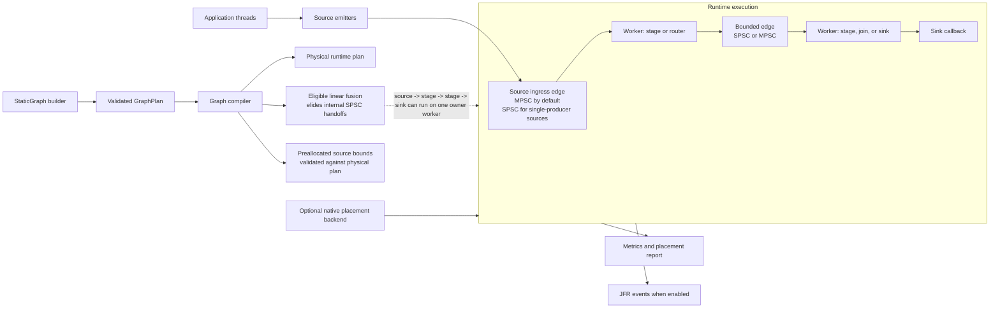

# Lattice

Lattice is a Java 21 static-topology runtime for bounded, low-latency
processing graphs. Applications declare sources, stages, routing nodes, joins,
and sinks before startup; Lattice validates the graph and compiles it into
dedicated workers connected by bounded SPSC and MPSC ring edges.

The project is designed for systems where the processing shape is known in
advance and predictability matters more than elastic topology changes: market
data pipelines, validation chains, reserved-core services, and other workloads
that benefit from explicit ownership, locality, and deterministic
backpressure.

Lattice is not a distributed stream processor, a broker, or a general queue
replacement. It is an in-process runtime for fixed graphs with explicit
ownership and backpressure.

## Project Status

- Pre-1.0. Source checkout is the supported path until Maven Central artifacts
  are published.
- Java 21 is the current build baseline.
- The JPMS module name is `com.lattice`.
- The main runtime is Java. The optional native backend is Rust JNI for Linux
  placement and topology diagnostics.
- Licensed under the [Apache License 2.0](LICENSE).

## Contents

- [Features](#features)
- [Architecture](#architecture)
- [Quick Start](#quick-start)
- [Benchmark Snapshot](#benchmark-snapshot)
- [Documentation](#documentation)
- [Build and Verification](#build-and-verification)
- [Native Placement Backend](#native-placement-backend)
- [Positioning](#positioning)
- [Contributing](#contributing)

## Features

- Static graph DSL for sources, stages, sinks, dispatch, broadcast, partition,
  and join nodes.
- Bounded SPSC and MPSC ring edges with explicit overflow and wait policies.
- Single-producer source specialization for topologies that can prove external
  producer ownership.
- Public preallocated source emitters for reusable payload paths.
- Opt-in linear stage fusion for eligible source-to-sink chains.
- Graph, stage, edge, placement, routing, join, wait, slab, and ownership
  metrics.
- Optional JFR events behind `-Dlattice.jfr=true`.
- Optional Rust JNI backend for Linux affinity and placement diagnostics.
- JUnit, JCStress, and JMH coverage in the current Gradle project.

## Architecture



The public graph plan remains logical and inspectable. Compiler optimizations
such as source specialization and stage fusion affect only the physical runtime
plan, and only when the compiler can preserve the configured semantics.

## Quick Start

### Requirements

- JDK 21.
- The checked-in Gradle wrapper.
- Rust and Cargo only if you need the optional native placement backend.

### Build

Windows:

```powershell
.\gradlew.bat test
.\gradlew.bat jmhClasses
```

Linux or WSL:

```bash
./gradlew test
./gradlew jmhClasses
```

### Minimal Graph

```java
import com.lattice.edge.EdgeSpec;
import com.lattice.graph.SourceMode;
import com.lattice.graph.StaticGraph;
import com.lattice.stage.Emitter;
import com.lattice.stage.StageSpec;
import java.time.Duration;

record Order(int id, boolean valid) {}
record ValidOrder(int id) {}

StaticGraph graph = StaticGraph.builder("orders")
    .source("ingress", Order.class, SourceMode.SINGLE_PRODUCER)
    .stage(
        "validate",
        Order.class,
        ValidOrder.class,
        (order, out, ctx) -> {
            if (order.valid()) {
                out.push(new ValidOrder(order.id()));
            }
        },
        StageSpec.singleThreaded()
    )
    .sink(
        "egress",
        ValidOrder.class,
        order -> {
            // Persist, publish, or hand off the validated order.
        },
        StageSpec.singleThreaded()
    )
    .edge("ingress", "validate", EdgeSpec.mpscRing(1024))
    .edge("validate", "egress", EdgeSpec.spscRing(1024))
    .build();

graph.start();

Emitter<Order> ingress = graph.emitter("ingress", Order.class);
ingress.emit(new Order(1, true));
ingress.close();

graph.awaitTermination(Duration.ofSeconds(5));
```

The ingress edge is declared as MPSC at the DSL boundary. Because the source is
marked `SINGLE_PRODUCER`, the compiler can specialize the physical edge to SPSC
where the topology allows it.

## Benchmark Snapshot

The repository includes local benchmark artifacts from
`results/apples-2026-04-26/` and additional smoke artifacts under
`docs/benchmark-results/`. These numbers are useful for orientation, but they
are not Linux, NUMA, or release-grade performance claims.

| Scenario | Result | Source Artifact | Notes |
| --- | ---: | --- | --- |
| Lattice fused three-stage pipeline | 79.13M ops/s | `pipeline-current-isolated.json` | Fusion enabled; internal handoffs compiled away. |
| Lattice physical three-stage pipeline | 27.13M ops/s | `pipeline-current-isolated.json` | Same pipeline shape without fused execution. |
| Disruptor three-stage pipeline | 6.97M ops/s | `pipeline-current-isolated.json` | Comparison row for this benchmark model. |
| Lattice fused pipeline with GC profiler | 41.07M ops/s, about 0 B/op | `pipeline-fused-current-isolated-gc.json` | GC profiler overhead changes throughput; use allocation data separately. |
| Lattice semantic join | 6.05M ops/s, about 0 B/op | `apples-fair-join-pooled.json` | Join semantics and payload model matter. |
| Disruptor dependency graph | 10.32M ops/s | `apples-fair-join-pooled.json` | Dependency graph comparison, not a general Disruptor result. |
| Lattice MPSC reference row | 8.51M ops/s | `apples-fair-join-pooled.json` | Four benchmark threads. |
| Disruptor MPSC reference row | 19.44M ops/s | `apples-fair-join-pooled.json` | Four benchmark threads. |
| Disruptor single-producer baseline | 33.66M ops/s | `disruptor-baseline-single.json` | Preferred baseline over the anomalous SPSC apples Disruptor row. |

Benchmark caveats:

- The listed results were captured on a Windows development host with JDK 21.
- GC-profiler runs are not directly comparable to non-profiled throughput
  runs.
- Apples-to-apples rows depend on payload ownership, allocation behavior, and
  dependency semantics.
- The current benchmark set should be treated as local evidence until a
  publication-grade Linux/NUMA report is checked in.

For tuning guidance, JVM flags, and methodology notes, see
[Performance Tuning](PERFORMANCE_TUNING.md) and
[Benchmark Baseline](docs/benchmark-baseline.md).

## Documentation

- [Getting Started](docs/getting-started.md)
- [Graph DSL](docs/graph-dsl.md)
- [Edge Semantics](docs/edge-semantics.md)
- [Ordering Guarantees](docs/ordering-guarantees.md)
- [Backpressure](docs/backpressure.md)
- [Observability](docs/observability.md)
- [Performance Tuning](PERFORMANCE_TUNING.md)
- [Source Specialization and Fusion](docs/source-specialization-and-fusion.md)
- [Disruptor Comparison](docs/disruptor-comparison.md)
- [Operations Runbook](docs/operations-runbook.md)
- [Failure Modes](docs/failure-modes.md)
- [Compatibility Matrix](docs/compatibility-matrix.md)
- [Linux Validation Notes](docs/linux-validation.md)

Examples:

- [Examples overview](docs/examples/README.md)
- [Preallocated source/sink](src/examples/java/com/lattice/examples/PreallocatedSourceSinkExample.java)
- [Fused linear pipeline](src/examples/java/com/lattice/examples/FusedLinearPipelineExample.java)
- [Routing and join](src/examples/java/com/lattice/examples/RoutingJoinExample.java)
- [Metrics diagnostics](src/examples/java/com/lattice/examples/MetricsDiagnosticsExample.java)
- [Benchmark-style fast path](src/examples/java/com/lattice/examples/BenchmarkStyleFastPathExample.java)

## Build and Verification

Windows:

```powershell
.\gradlew.bat test
.\gradlew.bat jmhClasses
.\gradlew.bat jcstress
.\gradlew.bat examplesClasses
```

Linux or WSL:

```bash
./gradlew test
./gradlew jmhClasses
./gradlew jcstress
./gradlew examplesClasses
```

Release-oriented local checks:

```bash
./gradlew releaseCheck
./gradlew verifyOpenSourceRelease
```

## Native Placement Backend

The native backend is optional and currently uses Rust JNI. Build it when you
need Linux affinity or placement diagnostics:

```bash
./gradlew nativeBuildRelease
```

Run Java with the native library visible:

```bash
java -Djava.library.path=native/static-topology-native/target/release ...
```

Without the native library, placement requests degrade through metrics and
startup diagnostics by default. Set `-Dlattice.placement.strict=true` to fail
startup when requested placement cannot be applied.

## Positioning

Lattice is strongest when a fixed topology lets the compiler replace broad
coordination with edge-local sequencing, source specialization, stage fusion,
and bounded memory. Shared-ring designs such as Disruptor can still be a better
fit for workloads with one global sequence domain or broad multicast dependency
barriers.

## Contributing

Read [CONTRIBUTING.md](CONTRIBUTING.md) before opening changes. Runtime changes
should preserve the project scope: fixed in-process graphs, explicit
backpressure, measured hot paths, and clear operational diagnostics.

Security reporting guidance is in [SECURITY.md](SECURITY.md).
