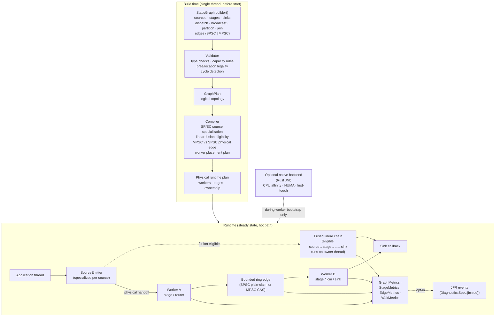

# Architecture

This page is the deep-dive companion to the README's "How Lattice Works"
section.

## Build vs Runtime Split

Lattice is split into three phases:

1. **DSL** — the application uses `StaticGraph.builder(...)` to declare
   sources, stages, routing nodes, joins, sinks, and edges.
2. **Compile** — the builder validates the topology and produces a
   `GraphPlan`, which the compiler lowers into a physical runtime plan
   (workers, edges, ownership, fusion decisions).
3. **Run** — workers come up, optional native placement is applied at
   bootstrap, and the steady-state hot path runs without ever returning to
   the compiler.

Build/compile happens once on a single thread, before `start()` returns.
Nothing on the hot path allocates new workers, opens new edges, or rewrites
the plan.



## The Compiler Decisions

| Decision | Inputs | Effect |
| --- | --- | --- |
| Source specialization | `SourceMode`, downstream edge shape | Pick SPSC physical ingress when the user contract is single-producer; wire the trusted-fast emit path for non-stamping, non-handle messages. |
| Edge shape selection | Producer count, declared `EdgeSpec` | Upgrade MPSC → SPSC where provably safe; round capacity to a power of two. |
| Linear fusion | Topology shape, payload type, `StageSpec`, `FusionSpec` | Remove eligible internal SPSC handoffs; source-inline producer-thread execution is a separate per-graph opt-in. |
| Worker placement | `PinPolicy`, `GraphPlacementSpec`, native lib status | Ask the native backend to apply CPU affinity / NUMA preference at bootstrap; degrade to advisory if the lib is missing and strict placement is not enabled for the graph. |
| Slab handle wiring | Payload type carries handle? | Emit `Retaining` hop variants where needed, `Benign` hop variants otherwise. |

## What Stays Inspectable

Even after fusion, the *logical* graph remains inspectable through `GraphPlan`
and `GraphMetrics`. Per-stage and logical fused-edge counters are available
when enabled through `MetricsSpec`; per-edge metrics for elided physical edges
otherwise report zero traffic, and the placement report still names every
logical worker. The fusion decision is documented in the plan, not hidden.

## Graph Runtime Specs

Runtime controls are graph-local rather than JVM-global:

```java
StaticGraph.builder("orders")
    .fusion(FusionSpec.defaults().inlineSources(true))
    .metrics(MetricsSpec.off().hotCounters(true))
    .placement(GraphPlacementSpec.off().strict(true))
    .diagnostics(DiagnosticsSpec.off().jfr(true))
    .build();
```

The defaults are fusion enabled, metrics off, source inline off, source
physical-path elision off, topology-aware placement off, strict placement off,
first-touch placement off, and JFR off.

## See Also

- [Graph DSL](graph-dsl.md)
- [Edge Semantics](edge-semantics.md)
- [Source Specialization and Fusion](source-specialization-and-fusion.md)
- [Disruptor Comparison](disruptor-comparison.md)
