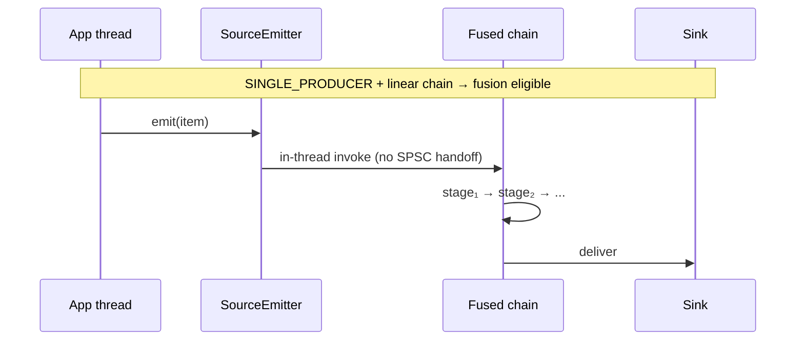

# Source Specialization and Fusion

Two of Lattice's most important compile-time optimizations are *source
specialization* and *linear fusion*. Both preserve the logical graph
contract; they change only the physical runtime plan.

## Source Specialization

When a `source` is declared with `SourceMode.SINGLE_PRODUCER`, the application
is contractually promising that at most one thread emits at a time. With this
contract:

- The compiler can pick an SPSC physical ingress edge even if the user wrote
  `EdgeSpec.mpscRing(...)` for readability.
- The producer-side hot path collapses to "abort-check + edge.offer + record"
  with no CAS.
- Trusted-fast-path emit (`EdgeSender.emitTrustedFromSource`) is wired when
  the source is non-stamping and the message type cannot carry a slab handle.

## Linear Fusion

A linear chain — `source → stage₁ → stage₂ → ... → sink` — with no fan-out,
fan-in, or routing in the middle is *fusion-eligible*. When fusion fires, the
SPSC handoffs between stages are removed and the chain runs on the producer
thread.

Implementation notes:

- Each `LinearStageOutput` holds a `final` reference to its successor (not an
  array slot). The JIT inlines through every fused hop monomorphically.
- Hops are specialized into `Benign` (POJO payload) and `Retaining` (slab
  handle) variants chosen at wire time. `Benign` drops the per-hop
  try/catch/finally frame.
- Intra-fused type validation is gated by `-Dlattice.fusion.validateTypes`
  (default `false`) — the public ingress emit boundary already validates the
  user-supplied type.

## Toggles

| Property | Default | Effect |
| --- | --- | --- |
| `-Dlattice.fusion.inlineSource=true` | true | Run the fused chain on the producer thread for eligible single-producer graphs. |
| `-Dlattice.fusion.validateTypes=false` | false | Re-enable defensive intra-fused type assertions while developing custom `StageLogic`. |

## When Fusion Does *Not* Fire

- Multi-producer sources.
- Fan-out (broadcast/partition/dispatch) inside the chain.
- Joins inside the chain.
- A stage opts out via `StageSpec`.
- A retaining payload escapes a broadcast where retain/release cannot be
  proven balanced.

In all these cases the physical edges remain and ordering, ownership, and
backpressure work as documented in [Edge Semantics](edge-semantics.md).

