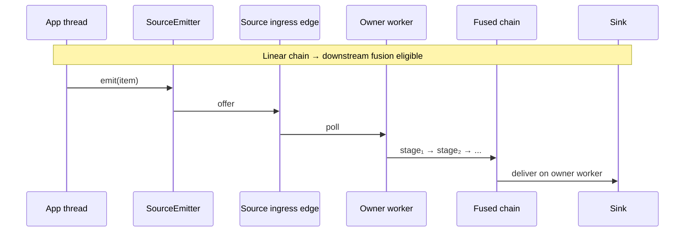

# Source Specialization and Fusion

Two of Lattice's most important compile-time optimizations are *source
specialization* and *linear fusion*. Both preserve the logical graph
contract; they change only the physical runtime plan.

## Source Specialization

When a `source` is declared with `SourceMode.SINGLE_PRODUCER`, the application
is contractually promising that at most one thread emits at a time. With this
contract:

- The compiler can pick an SPSC physical ingress edge even if the user wrote
  `EdgeSpec.mpscRing(...)` for readability.
- The producer-side hot path collapses to "close-check + edge.offer + record"
  with no CAS.
- Trusted-fast-path emit (`EdgeSender.emitTrustedFromSource`) is wired when
  the source is non-stamping and the message type cannot carry a slab handle.
- Application code must externally serialize source close, graph stop, and
  graph abort with active `emit(...)` calls in this mode. Use the default
  `SourceMode.MULTI_PRODUCER` when foreign lifecycle calls may race producers.

## Linear Fusion

A linear chain — `source → stage₁ → stage₂ → ... → sink` — with no fan-out,
fan-in, or routing in the middle is *fusion-eligible*. When fusion fires, the
SPSC handoffs between stages are removed. Normal downstream fusion keeps the
source boundary physical and runs the fused chain on the owner worker.



Source-inline fusion is a separate opt-in. When
`FusionSpec.defaults().inlineSources(true)` is set and all safety checks pass,
`emitter.emit(...)` may run the stage chain and sink synchronously on the
calling producer thread. If
`elideInlineSourcePhysicalPath(true)` is also set, the runtime may remove the
source ingress edge and lifecycle-only owner worker for eligible chains.

Implementation notes:

- Each `LinearStageOutput` holds a `final` reference to its successor (not an
  array slot). The JIT inlines through every fused hop monomorphically.
- Hops are specialized into `Benign` (POJO payload) and `Retaining` (slab
  handle) variants chosen at wire time. `Benign` drops the retain/release
  scope and keeps exception-path attribution per fused hop.
- Intra-fused type validation is gated by
  `FusionSpec.defaults().validateTypes(true)` — the public ingress emit boundary
  already validates the user-supplied type.
- Inline source fusion is disabled when a custom `StageExceptionHandler` is
  installed so handler policy stays on the worker path.
- Inline source fusion is disabled when explicit effective placement or
  topology-aware placement applies to the chain. This preserves the contract
  that pinned/topology-placed stage logic runs on the placed owner worker.

## Per-Graph Controls

| API | Default | Effect |
| --- | --- | --- |
| `FusionSpec.defaults()` | enabled | Allow normal downstream stage/sink/router fusion where legal. |
| `FusionSpec.disabled()` | off only when selected | Force the physical baseline for that graph. |
| `inlineSources(true)` | false | Allow producer-thread source-inline execution for eligible single-producer graphs. |
| `elideInlineSourcePhysicalPath(true)` | false | Allow removal of the lifecycle-only owner worker and source ingress edge for eligible source-inline chains. |
| `validateTypes(true)` | false | Enable defensive intra-fused type assertions while developing custom `StageLogic`. |

## When Fusion Does *Not* Fire

- Multi-producer sources.
- Custom `StageExceptionHandler` when considering producer-thread inline
  source fusion.
- Explicit stage pinning or topology-aware placement when considering
  producer-thread inline source fusion.
- Fan-out (broadcast/partition/dispatch) inside the chain.
- Joins inside the chain.
- A stage opts out via `StageSpec`.
- A retaining payload escapes a broadcast where retain/release cannot be
  proven balanced.

In all these cases the physical edges remain and ordering, ownership, and
backpressure work as documented in [Edge Semantics](edge-semantics.md).

`graph.compilationReport()` records both positive merge decisions and
reason-coded fallbacks. That keeps "why did this not fuse?" answerable without
inferring from metrics or reading internals.

```text
edges:
  parse->risk declared=SPSC_RING effective=SPSC_RING use=NORMAL owner=parse
merges:
  STAGE_TO_SINK owner=risk merged=[egress] elided=[risk->egress] terminal=egress
fallbacks:
  fusion.non_fusible_edge.overflow edge=parse->risk: Stage-chain fusion requires BLOCK overflow.
```

For source specialization, the same report shows the declared edge and the
effective runtime edge:

```text
ingress->parse declared=MPSC_RING effective=SPSC_RING use=NORMAL owner=parse
  source.specialized_to_spsc: Source ingress specialized because ingress is SINGLE_PRODUCER.
```
